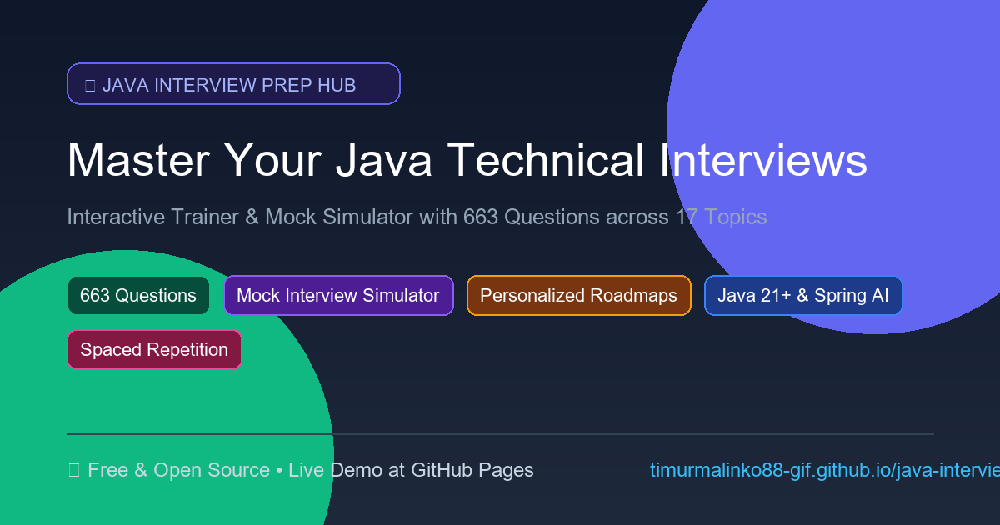

<div align="center">
  
# 🚀 Java Interview Prep Hub & AI Simulator
**The Ultimate Software 3.0 Platform for Acing Java Engineering Interviews**

<p align="center">
  
  
  
  
  
  
  
  
  <a href="https://timurmalinko88-gif.github.io/java-interview/"></a>
</p>

An interactive, hyper-optimized Single Page Web Application (SPA), mock interview simulator, learning roadmap system, and structured knowledge base engineered for acing technical Java interviews — from **Junior** to **Senior** and **Lead / Architect** level.

[](https://timurmalinko88-gif.github.io/java-interview/)
[](#-core-breakthrough-features)
[](https://github.com/timurmalinko88-gif/java-interview)

<br>

<br><br>

</div>

---

## 🌟 Visual Showcase / Demo Highlights

| 🧠 **In-Browser AI Examiner** | 🔍 **Client-Side RAG Search** |
| :--- | :--- |
| Real-time Web Speech dictation with quantized LLMs (`Qwen2.5-Coder` / `Llama-3.2`) running via WebGPU directly in your browser. Complete with ground-truth scorecard evaluation. | Instant $< 0.5$ ms cosine similarity search across 706 questions via `all-MiniLM-L6-v2` and Web Workers. No backend required. |

| 🏗️ **Interactive Architecture Flow** | 🧮 **Algorithm Breakdown Engine** |
| :--- | :--- |
| Interactive System Architecture SVG Flow Simulator mapping data flow across microservices layers with production code snippets. | Step-by-step interactive visual breakdowns for classic sorting, dynamic programming, and graph algorithms. |

---

## 🚀 Core Breakthrough Features

- 🧠 **Zero-Server Semantic Vector Search (Client-Side RAG)**: On-the-fly cosine similarity via `all-MiniLM-L6-v2` & Web Workers ($< 0.5$ ms search across 706 questions).
- 🎙️ **In-Browser WebLLM AI Examiner**: WebGPU hardware acceleration running quantized LLMs (`Qwen2.5-Coder` / `Llama-3.2`) directly in the candidate's browser with real-time Web Speech dictation and ground-truth scorecard evaluation.
- 🗺️ **4 Curated Roadmaps & Adaptive Diagnostic Engine**: Junior Express, Middle Spring, Senior Architect, AI & Modern Java 21+.
- 🏗️ **Interactive System Architecture SVG Flow Simulator**: Visual data flow across microservices layers with production code snippets.
- 🧮 **Algorithm Breakdown Engine**: Step-by-step interactive breakdowns for classic sorting, DP, and graphs.
- ⚡ **Spaced Repetition (SRS Leitner Box) & 7-Tier Rank Gamification**: Optimize your memory retention and track your progress from *Junior Trainee* to *Java Architect*.

---

## 🛠 Complete Tech Stack Deep-Dive

| Category | Technologies | Description |
| :--- | :--- | :--- |
| **Frontend** | Vanilla JS (ES Modules), Vite 8, Tailwind CSS, Marked.js, Highlight.js, FontAwesome 6 | Ultra-fast, bloat-free reactive UI powered by modern web standards. |
| **AI & Machine Learning** | WebGPU TVM/MLC (`@mlc-ai/web-llm`), ONNX Runtime Web / Transformers.js (`@xenova/transformers`, `all-MiniLM-L6-v2`), Web Speech API | Client-side intelligence executing quantized LLMs & embedding models with zero server costs. |
| **Indexing & Tooling** | Python 3 AST parser (`build.py`), Node.js vector generator (`tools/build_embeddings.mjs`) | Powerful build chain to pre-compute metadata and embeddings. |
| **Testing** | Playwright | E2E test suite ensuring rock-solid UI & interaction stability. |
| **Hosting & CI/CD** | GitHub Pages, GitHub Actions | 100% Free Static hosting delivering the Progressive Web App (PWA) globally. |

---

## 📊 Content Breakdown & Statistics

The repository contains exactly **706 curated questions** categorized across **18 domains**:

| Category | # of Questions |
| :--- | :---: |
| **AI & LLM Integration** | 20 |
| **Algorithm Breakdown** | 50 |
| **Behavioral & STAR** | 10 |
| **Collections** | 52 |
| **Databases** | 52 |
| **Exceptions** | 2 |
| **General** | 46 |
| **JVM & Memory Management** | 52 |
| **Kafka & Messaging** | 20 |
| **Live Coding & Refactoring** | 15 |
| **Modern Java 21+** | 15 |
| **Multithreading** | 52 |
| **OOP** | 52 |
| **Patterns** | 50 |
| **Spring** | 58 |
| **Stream API** | 52 |
| **System Design** | 58 |
| **Testing** | 50 |
| **Total** | **706** |

---

## 🚀 Quick Start & Local Development

Experience the full capabilities of the platform locally in 3 simple steps:

```bash
# 1. Clone the repository
git clone https://github.com/timurmalinko88-gif/java-interview.git
cd java-interview

# 2. Install dependencies
npm install

# 3. Start the Vite 8 dev server
npm run dev
```

### Build & Indexing Chain
If you modify content or embeddings, use the built-in pipelines:
```bash
# Rebuild the question index JSON
python build.py

# Regenerate vector embeddings for semantic search
node tools/build_embeddings.mjs

# Build for production
npm run build
```

### Testing
Run the E2E test suite using Playwright:
```bash
npx playwright test
```

---

## 🤖 Vibecoding & Software 3.0 Extensibility

This repository is built with an AI-first mindset. It fully embraces the **Software 3.0** paradigm. 
If you wish to contribute or generate new question banks, we provide a structured `VIBECODING.md` and `AGENTS.md` guide. 

Developers can seamlessly vibecode new features, interactive visualizers, or UI components using modern LLMs (Claude 3.5 Sonnet, GPT-4o, etc.). Just feed the provided context documents to your agent and watch it construct production-ready code aligned with our vanilla architecture.

---

## 🤝 Community & Contributing

We welcome contributions of all sizes! 

1. **Fork** the repository and create your feature branch (`git checkout -b feature/amazing-feature`).
2. **Commit** your changes (`git commit -m 'Add some amazing feature'`).
3. Ensure you run `python build.py` and `node tools/build_embeddings.mjs` if you add new content.
4. **Push** to the branch (`git push origin feature/amazing-feature`).
5. Open a **Pull Request**.

Please refer to the `AGENTS.md` and `VIBECODING.md` files for deeper architectural insights and contribution guidelines.

---

## 📜 License

Distributed under the **MIT License**. See the `LICENSE` file for more information.

<p align="center">
  <i>Empowering engineers to master Java, from core fundamentals to cutting-edge AI integration.</i>
</p>
