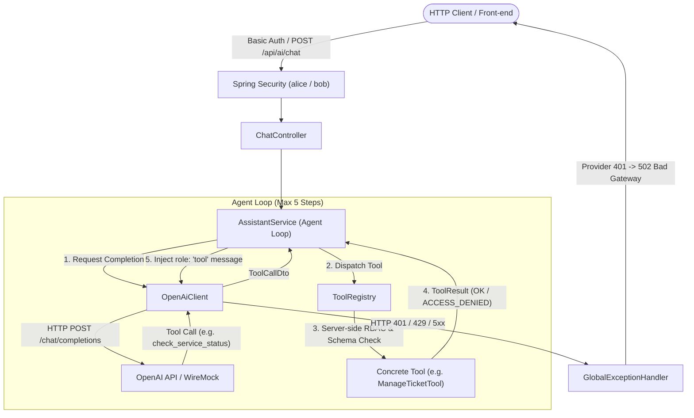

# 🤖 Production-Grade Spring Boot LLM Support Assistant

> **Reference Backend Implementation** for the Java Interview Prep Hub track: *LLM Integration with Java*.
> Demonstrates a secure, enterprise-grade AI Support Assistant in **Java 17** & **Spring Boot 3.2+** featuring function calling (OpenAI API `gpt-4o-mini`), server-side RBAC, error isolation, resilient backoff, and automated evaluation.

---

## 🏛️ Architecture Overview



---

## 🎯 Key Design Principles

1. **Official Provider API Specification**:
   - Provider: **OpenAI Chat Completions API** (`https://api.openai.com/v1/chat/completions`).
   - Default Model: `gpt-4o-mini`.
   - Tool calling format adheres to the official JSON schema specification (`tools` array, `type: "function"`, parameter schema).
   - *Verification Date*: March 2026.
2. **Server-Side RBAC (Zero Trust for LLM Arguments)**:
   - Authenticated users:
     - `alice` (Password: `password`, Role: `ROLE_SUPPORT_AGENT`)
     - `bob` (Password: `password`, Role: `ROLE_SUPPORT_TRAINEE`)
   - The user identity and authorization level are **always** extracted from Spring Security's `Authentication` context, **never** from tool arguments generated by the model.
3. **Provider Error Taxonomy & Isolation**:
   - **Internal App 401 != Provider 401**: If the upstream LLM returns 401 (invalid/expired API key), the application responds with **502 Bad Gateway** (`PROVIDER_AUTH_ERROR`). This prevents leaking internal credentials and clearly separates client authentication errors from upstream supplier failures.
   - **Rate Limit Resilience (429)**: The client parses the `Retry-After` header supporting both **integer seconds** (`Retry-After: 3`) and **RFC 1123 HTTP-Date** (`Retry-After: Wed, 21 Oct 2026 07:28:00 GMT`). Retries use a testable `Sleeper` abstraction (zero-latency in tests).
4. **Loop Budget Protection**:
   - Hard cap of **5 iterations** per chat request to guarantee bounded execution, preventing runaway API billing and latency spikes.

---

## 🚀 Quickstart & Verification

### Prerequisites
- Java 17+ installed (`java -version`, `javac -version`).
- No pre-installed Maven required (the project includes a fully self-contained **Maven Wrapper**).

### 1. Build and Run All Verification Tests
Execute the verification suite (unit tests, WireMock integration tests, RBAC checks, and 15 eval scenarios):

```bash
# On Windows (cmd or PowerShell)
.\mvnw.cmd clean verify

# On Linux / macOS
./mvnw clean verify
```

### 2. Start the Spring Boot Application
```bash
# Windows
.\mvnw.cmd spring-boot:run

# Linux / macOS
./mvnw spring-boot:run
```
The server starts on `http://localhost:8080`.

---

## 🧪 Testing the API & RBAC

### Scenario A: Alice creates a ticket (Authorized — 200 OK)
```bash
curl -i -u alice:password -X POST http://localhost:8080/api/ai/chat \
  -H "Content-Type: application/json" \
  -d '{"message":"Check billing service and create a HIGH priority ticket for webhook lag","conversationId":"test-1"}'
```

### Scenario B: Bob attempts to create a ticket (RBAC Forbidden — Handled Gracefully)
```bash
curl -i -u bob:password -X POST http://localhost:8080/api/ai/chat \
  -H "Content-Type: application/json" \
  -d '{"message":"Create a CRITICAL ticket for auth service","conversationId":"test-2"}'
```
*Result*: `ManageTicketTool` intercepts Bob's authority, rejects execution with `ACCESS_DENIED`, and the assistant returns an explanatory response without crashing.

### Scenario C: Service Health Check (Both Alice and Bob Authorized)
```bash
curl -i -u bob:password -X POST http://localhost:8080/api/ai/chat \
  -H "Content-Type: application/json" \
  -d '{"message":"What is the current operational status of the billing service?","conversationId":"test-3"}'
```

---

## 📊 15 Evaluation Benchmark Scenarios

The suite includes 15 automated benchmark scenarios stored in `evals/eval-scenarios.json`:
- **5 Direct QA Scenarios**: Greeting, architecture concepts, transactional mechanics, token budget, sign-off.
- **5 Multi-Turn Tool Calling Scenarios**: Status checks, knowledge base search, authorized ticket creation.
- **3 Security & Adversarial Scenarios**: RBAC violation attempt, prompt injection attempt, non-existent tool invocation.
- **2 Resilience & Boundary Scenarios**: Invalid parameter lengths, upstream 429 rate limit backoff.

### Running the Standalone Eval Runner
```bash
# Run against deterministic test harness:
.\mvnw.cmd test-compile exec:java -Dexec.mainClass="com.example.assistant.eval.EvalRunner" -Dexec.classpathScope="test"

# Or run against live OpenAI API:
.\mvnw.cmd test-compile exec:java -Dexec.mainClass="com.example.assistant.eval.EvalRunner" -Dexec.classpathScope="test" -Dlive=true -DLLM_API_KEY="sk-..."
```

---

## 📚 6 Practical Development Stages

1. **Stage 1: Raw HTTP & Serialization**: Direct `java.net.http.HttpClient` calls to `/v1/chat/completions` with Jackson DTOs and timeouts.
2. **Stage 2: Tool Calling Specification**: Modeling tools as JSON schemas and handling `tool_calls` assistant responses.
3. **Stage 3: Server-side RBAC**: In-memory Spring Security, extracting caller principal, role enforcement on sensitive tools.
4. **Stage 4: Agent Loop Safeguards**: Multi-turn dialogue history management with a 5-step loop limit and token tracking.
5. **Stage 5: Resilience & Error Isolation**: `Retry-After` parsing (seconds + RFC 1123 date), controllable `Sleeper`, mapping provider 401 to 502 Bad Gateway.
6. **Stage 6: Systematic Evaluation**: Automated WireMock integration tests and 15 scenario benchmark scorecard.

---

## 📝 Student Practical Report Template

When completing this module as part of the Java Interview Prep course, fill in the following scorecard report:

```markdown
### LLM Integration with Java — Student Implementation Report

- **Developer**: [Your Name / GitHub Handle]
- **Date**: [YYYY-MM-DD]
- **Target LLM Provider**: OpenAI (gpt-4o-mini)
- **Spring Boot Version**: 3.2.5 (Java 17)

#### 1. Verification Test Results
- `mvnw.cmd verify` status: [PASS / FAIL]
- Total Tests Executed: [e.g. 15 unit/eval + 5 WireMock integration]
- Failures / Errors: 0

#### 2. Key Architecture Decisions
- Principal resolution source: Spring Security SecurityContextHolder (zero LLM parameter trust)
- Upstream 401 handling: Mapped to HTTP 502 with PROVIDER_AUTH_ERROR
- Rate limit strategy: Retry-After header parsed with exponential backoff fallback
- Agent loop guard: Hard cutoff at 5 iterations

#### 3. Benchmark Scorecard
| Category | Scenarios | Passed | Notes |
| :--- | :--- | :--- | :--- |
| Direct QA | 5 | 5 | Zero tool calls triggered |
| Tool Calling | 5 | 5 | Valid JSON parameters parsed |
| RBAC Enforcement | 1 | 1 | Bob correctly denied (ACCESS_DENIED) |
| Security / Adversarial | 2 | 2 | Injection and rogue tool handled |
| Resilience & Validation| 2 | 2 | Boundary errors caught before execution |
```
